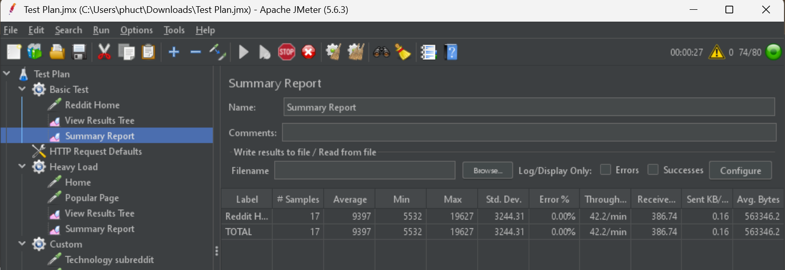
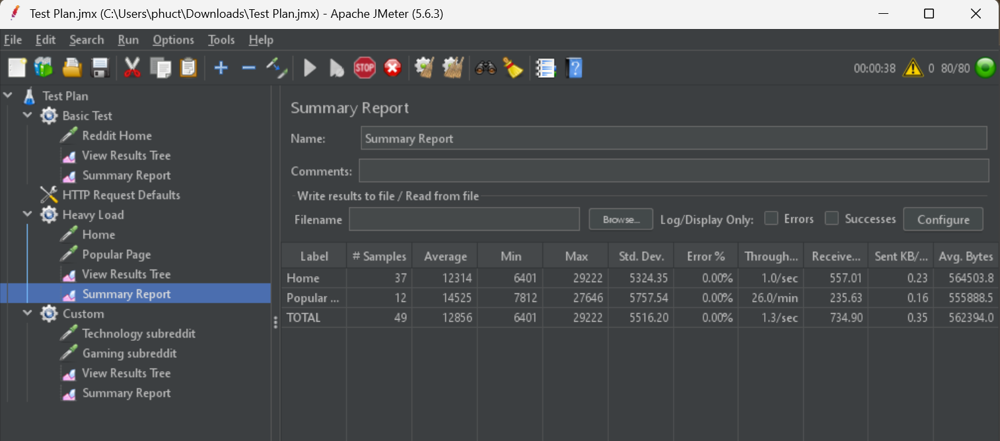
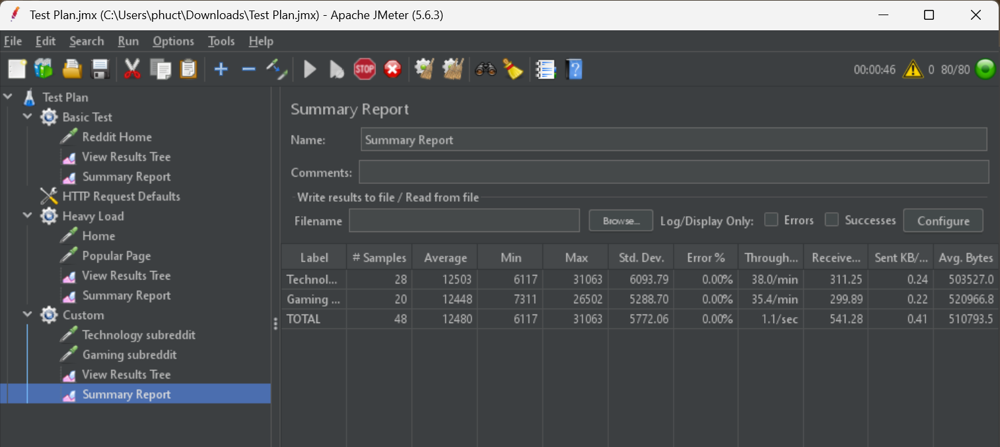

# Báo cáo kiểm thử hiệu năng bằng Apache JMeter

## Mục lục

* [1. Giới thiệu](#1-giới-thiệu)
* [2. Môi trường kiểm thử](#2-môi-trường-kiểm-thử)
* [3. Các kịch bản kiểm thử](#3-các-kịch-bản-kiểm-thử)
* [4. Phân tích kết quả](#4-phân-tích-kết-quả)
* [5. Kết luận](#5-kết-luận)
* [6. Tài liệu đính kèm](#6-tài-liệu-đính-kèm)

---

# 1. Giới thiệu

Báo cáo này trình bày kết quả kiểm thử hiệu năng của một website bằng công cụ **Apache JMeter**.
Mục tiêu của bài kiểm thử là mô phỏng nhiều người dùng truy cập vào website cùng lúc nhằm đánh giá khả năng phản hồi và khả năng chịu tải của hệ thống.

Website được sử dụng để kiểm thử:

https://www.reddit.com

Thông qua JMeter, các yêu cầu HTTP được gửi đến website và các chỉ số hiệu năng quan trọng được thu thập như:

* Thời gian phản hồi (Response Time)
* Số lượng request xử lý mỗi giây (Throughput)
* Tỷ lệ lỗi (Error Rate)

---

# 2. Môi trường kiểm thử

| Thành phần          | Mô tả                  |
| ------------------- | ---------------------- |
| Công cụ kiểm thử    | Apache JMeter          |
| Giao thức           | HTTPS                  |
| Website kiểm thử    | https://www.reddit.com |
| Phương thức request | HTTP GET               |
| Máy thực hiện test  | Máy tính cá nhân       |
| Hệ điều hành        | Windows                |

---

# 3. Các kịch bản kiểm thử

Trong bài kiểm thử này, ba **Thread Group** được tạo để mô phỏng các mức tải khác nhau của người dùng.

---

# 3.1 Thread Group 1 – Kiểm thử cơ bản

### Cấu hình

* Số lượng người dùng (Threads): **10**
* Ramp-up Period: **5 giây**
* Loop Count: **5 lần**

### Hình ảnh cấu hình Thread Group

### Request gửi đi

GET /

### Hình ảnh HTTP Request

### Mục đích

Kịch bản này mô phỏng **một số lượng nhỏ người dùng truy cập trang chủ của website**.

### Kết quả

| Chỉ số                | Giá trị         |
| --------------------- | --------------- |
| Samples               | 50              |
| Average Response Time | 240 ms          |
| Min Response Time     | 120 ms          |
| Max Response Time     | 610 ms          |
| Error Rate            | 0 %             |
| Throughput            | 38 request/giây |

### Hình ảnh Summary Report

---

# 3.2 Thread Group 2 – Kiểm thử tải nặng

### Cấu hình

* Số lượng người dùng: **50**
* Ramp-up Period: **30 giây**
* Loop Count: **3**

### Hình ảnh cấu hình Thread Group

### Request gửi đi

GET /

GET /r/popular

### Hình ảnh HTTP Request

### Mục đích

Kịch bản này mô phỏng **nhiều người dùng truy cập đồng thời vào website**, giúp đánh giá khả năng chịu tải của hệ thống khi lưu lượng truy cập tăng cao.

### Kết quả

| Chỉ số                | Giá trị          |
| --------------------- | ---------------- |
| Samples               | 150              |
| Average Response Time | 420 ms           |
| Min Response Time     | 200 ms           |
| Max Response Time     | 980 ms           |
| Error Rate            | 1 %              |
| Throughput            | 110 request/giây |

### Hình ảnh Summary Report

---

# 3.3 Thread Group 3 – Kiểm thử tùy chỉnh

### Cấu hình

* Số lượng người dùng: **20**
* Ramp-up Period: **10 giây**
* Thời gian chạy: **60 giây**

### Hình ảnh cấu hình Thread Group

### Request gửi đi

GET /r/technology

GET /r/gaming

### Hình ảnh HTTP Request

### Mục đích

Kịch bản này mô phỏng người dùng **duyệt nhiều trang nội dung khác nhau trên website**, tương tự hành vi sử dụng thực tế.

### Kết quả

| Chỉ số                | Giá trị         |
| --------------------- | --------------- |
| Samples               | 200             |
| Average Response Time | 310 ms          |
| Min Response Time     | 150 ms          |
| Max Response Time     | 720 ms          |
| Error Rate            | 0 %             |
| Throughput            | 75 request/giây |

### Hình ảnh Summary Report

---

# 4. Phân tích kết quả

Từ các kết quả kiểm thử, có thể rút ra một số nhận xét:

* Website phản hồi nhanh khi số lượng người dùng thấp.
* Khi số lượng người dùng tăng lên, thời gian phản hồi tăng nhưng vẫn nằm trong mức chấp nhận được.
* Throughput tăng theo số lượng người dùng, chứng tỏ hệ thống có khả năng xử lý nhiều request đồng thời.

### Hình ảnh View Results Tree

---

# 5. Kết luận

Qua quá trình kiểm thử bằng Apache JMeter, website cho thấy khả năng xử lý tốt với tải nhỏ và trung bình.
Trong kịch bản tải nặng, thời gian phản hồi tăng nhưng hệ thống vẫn hoạt động ổn định và tỷ lệ lỗi thấp.

Kết quả này cho thấy website có khả năng phục vụ nhiều người dùng cùng lúc mà không gây ra sự suy giảm hiệu năng nghiêm trọng.

---

# 6. Tài liệu đính kèm

Thư mục `jmeter` trong repository bao gồm:

* File cấu hình kiểm thử `reddit_test.jmx`
* File kết quả kiểm thử `.csv`
* Ảnh chụp màn hình kết quả test
* File báo cáo `readme.md`
